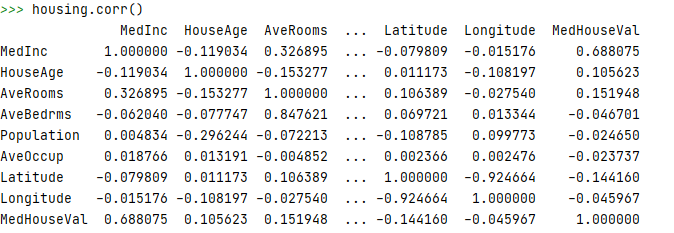
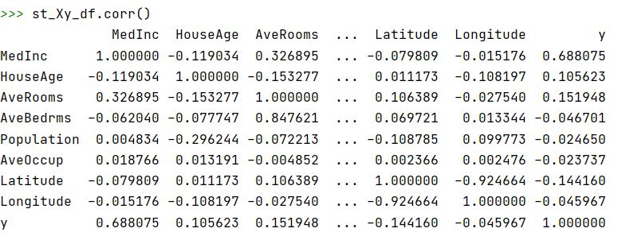

# Midterm Corrections 

The first step to answering the questions is importing the necessary libraries and data, and defining the `DoKFold` function.  

##### Importing Libraries 

```
import pandas as pd
import numpy as np
import matplotlib.pyplot as plt
from sklearn.linear_model import LinearRegression
from sklearn.model_selection import KFold
from sklearn.model_selection import train_test_split as tts
from sklearn.preprocessing import StandardScaler
from sklearn.datasets import fetch_california_housing
from sklearn.linear_model import Ridge
from sklearn.linear_model import Lasso
```
##### Importing the `california_housing` dataset 
```
data = fetch_california_housing(as_frame= True)
housing = data.frame

X = data.data
y = data.target
```

##### Defining the `DoKFold` function 

```
def DoKFold (model, X, y, k, standardize = False, random_state = 146):
    import numpy as np
    from sklearn.model_selection import KFold
    kf = KFold(n_splits = k, shuffle = True, random_state=random_state)

    if standardize:
        from sklearn.preprocessing import StandardScaler as SS
        ss = SS()

    train_scores = []
    test_scores = []

    train_mse = []
    test_mse = []

    for idxTrain, idxTest in kf.split(X):
        Xtrain = X[idxTrain, :]
        Xtest = X[idxTest, :]
        ytrain = y[idxTrain]
        ytest = y[idxTest]

        if standardize:
            Xtrain = ss.fit_transform(Xtrain)
            Xtest = ss.transform(Xtest)

        model.fit(Xtrain,ytrain)

        train_scores.append(model.score(Xtrain, ytrain))
        test_scores.append(model.score(Xtest, ytest))

        ytrain_pred = model.predict(Xtrain)
        ytest_pred = model.predict(Xtest)

        train_mse.append(np.mean((ytrain - ytrain_pred) ** 2))
        test_mse.append(np.mean((ytest - ytest_pred) ** 2))

        return train_scores, test_scores, train_mse, test_mse
```

## Question 15 

Finding the variable that is the most correlated with the target variable is as simple as running the following:
```
housing.corr()
```
This returns a matrix with the correlations of the variable with other variables. 



From this matrix we can see that the MedInc is most correlated with our target variable, MedHouseVal.

## Question 16

To transform the data, we use the `StandardScaler.fit_transform()` function. 
```
ss = StandardScaler()
st_X = ss.fit_transform(X)
```
Then, create a dataframe with the standardized X values and the target y values.
```
st_X_df = pd.DataFrame(st_X, columns= data.feature_names)
st_Xy_df = st_X_df.copy()
st_Xy_df['y'] = y
```
Finally, use the same function from question 15 to study the correlations.
```
st_Xy_df.corr()
```
 

we see that the correlations with the target y values are equivalent to those from question 15. 

## Question 17 

Perform a linear regression with just the MedInc variable and the y value.
```
lin_reg = LinearRegression()
X_df = pd.DataFrame(data.data)
lin_reg.fit(X_df['MedInc'].values.reshape(-1,1),y)
np.round(lin_reg.score(X_df['MedInc'].values.reshape(-1,1),y),2)
```
This returns a coefficient of determination of 0.47


## Question 18

The questions requires performing a linear regression on the standardized dataset. 

To do this, we can use the previously defined `DoKFold` function. 
```
k = 20
train_scores, test_scores, train_mse, test_mse = DoKFold(lin_reg, X,y,k,True)
```
Print the mean values of the training/testing scores
```
print(np.mean(train_scores), np.mean(test_scores))
``


