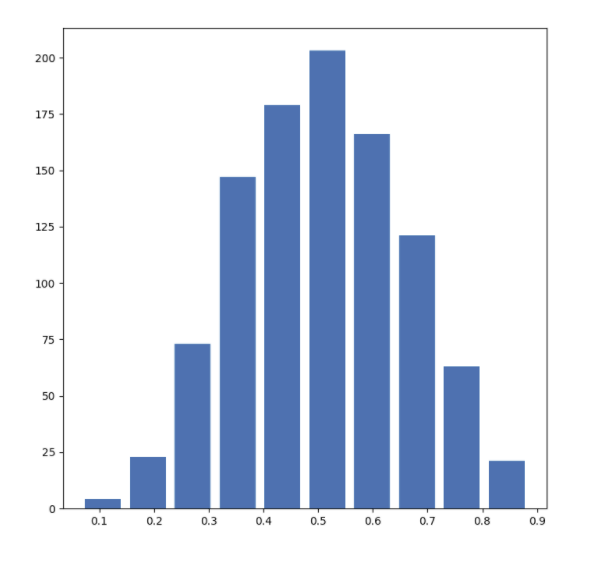
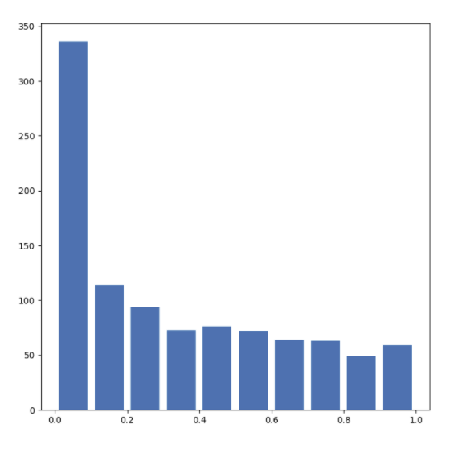
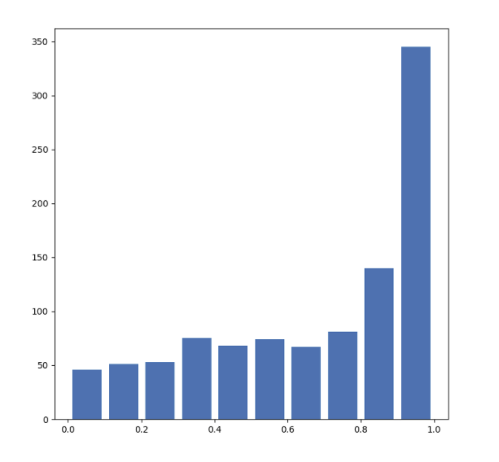
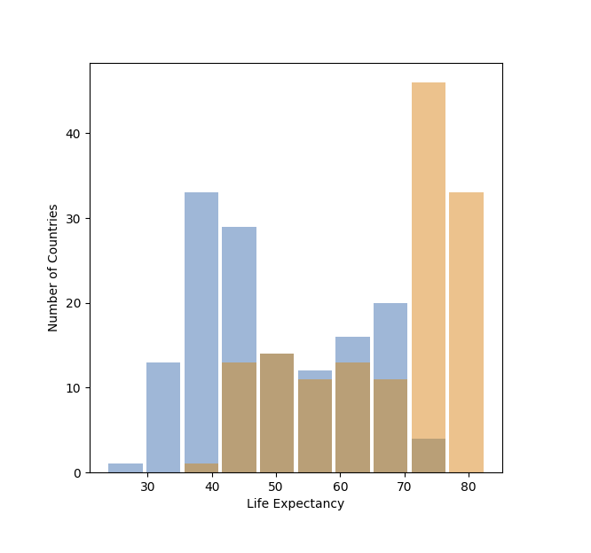
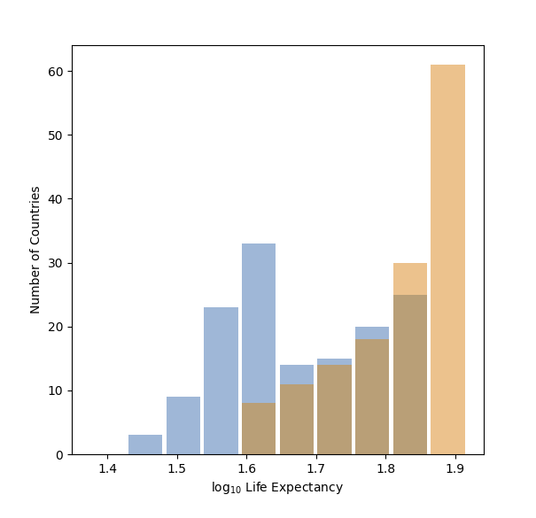
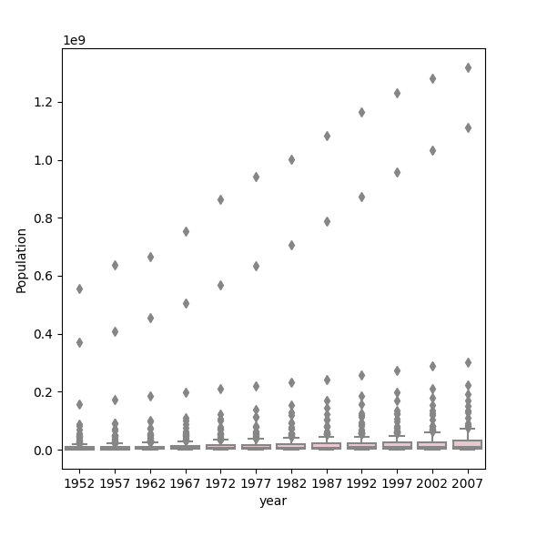
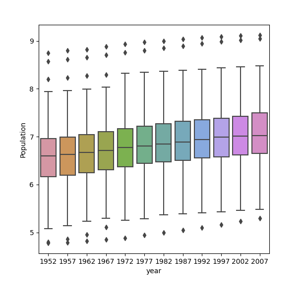

# Project 2

### Question 1: Describe continuous, ordinal and nominal data. Provide examples of each. Describe a model of your own construction that incorporates variables of each type of data. You are perfectly welcome to describe your model using english rather than mathematical notation if you prefer. Include hypothetical variables that represent your features and target.

Continuous data represents measurements. Length of an object in centimeters would be an example of continuous data. Ordinal data is data that is ordered by rank (1st, 2nd, 3rd, etc.). Any numerical ranking system can be considered ordinal data. Nominal data is categorical data that is labled with numbers. Zip codes are an example nominal data. 

Example Model:
Predicting Mercer Quality of Living City Ranking with GDP, population, and numerically-organized continent codes. The target (or dependent variable) here is the quality of living city ranking which is an example of ordinal data. The features (independent variables) are GDP, population, and numerically-organized continent codes. GDP and population are examples of continuous data and numerical continent codes are nominal data. 

### Question 2: Comment out the seed from your randomly generated data set of 1000 observations and use the beta distribution to produce a plot that has a mean that approximates the 50th percentile. Also produce both a right skewed and left skewed plot by modifying the alpha and beta parameters from the distribution. Be sure to modify the widths of your columns in order to improve legibility of the bins (intervals). Include the mean and median for all three plots.

To do this, 
```
import numpy as np
import pandas as pd
import matplotlib.pyplot as plt

n = 1000
a = 5
b = 5
#np.random.seed(10)
dataset = np.random.beta(a, b, size = n)
```
We can examine whether or not the mean lies in the 50th percentile by graphing. 
```
plt.figure(figsize = (8, 8))
plt.hist(dataset, rwidth = 0.8)
plt.show()
```


We can see that the distribution follows a standard bell curve, and therefore the mean does approximate the 50th percentile.
The mean for this dataset is 0.506 and the median is 0.504.

To create a right skewed plot, 
```
n = 1000
a = 0.5
b = 1
#np.random.seed(10)
rskew = np.random.beta(a, b, size = n)

plt.figure(figsize = (8, 8))
plt.hist(rskew, rwidth = 0.8)
plt.show()
```


The mean for this dataset is 0.338 and the median is 0.257.

To create a left-skewed plot:
```
n = 1000
a = 1
b = 0.5
#np.random.seed(10)
lskew = np.random.beta(a, b, size = n)

plt.figure(figsize = (8, 8))
plt.hist(lskew, rwidth = 0.8)
plt.show()
```


The mean for this dataset is 0.678 and the median is 0.783


### Question 3: Using the gapminder data set, produce two overlapping histograms within the same plot describing life expectancy in 1952 and 2007. Plot the overlapping histograms using both the raw data and then after applying a logarithmic transformation (np.log10() is fine). Which of the two resulting plots best communicates the change in life expectancy amongst all of these countries from 1952 to 2007?

The resulting plot looks like this:



After putting it through logarithmic transformation, the plot looks like this:

 

Comparing the two, you find that the second plot is the better visual representation of overall change. 
The relatively high variances of the first plot's distributions make it slightly more difficult to gauge
the difference, whereas the second plot's distributions are easier to spot out the difference.

### Question 4: Using the seaborn library of functions, produce a box and whiskers plot of population for all countries at the given 5-year intervals. Also apply a logarithmic transformation to this data and produce a second plot. Which of the two resulting box and whiskers plots best communicates the change in population amongst all of these countries from 1952 to 2007?

The plot looks like this:



The same plot with logarithmic transformation using ```numpy.log10()```



Again, the boxplot with the log transform communicates the change in population better, but this time the difference between the two graphs are very apparent. The raw data plot shows the outliers increasing by the years and the actual boxes are squeezed into the bottom of the plot, making it impossible to tell how most populations generally changed. This is due to the large outliers that deviate significantly from the mean/median; the outliers are so much bigger than the average that the averages are all squeezed into the bottom and not legible. The log transform data reduces the difference between the mean and the large outliers, and display the boxplots in a legible, easy to read manner. 
