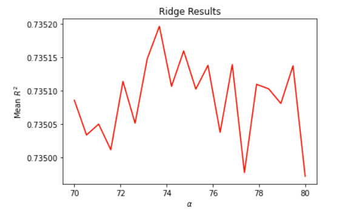
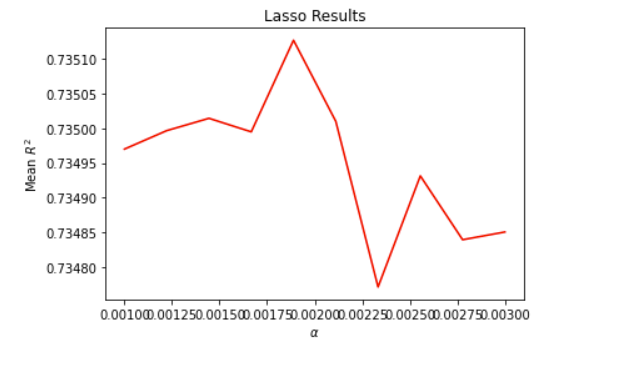
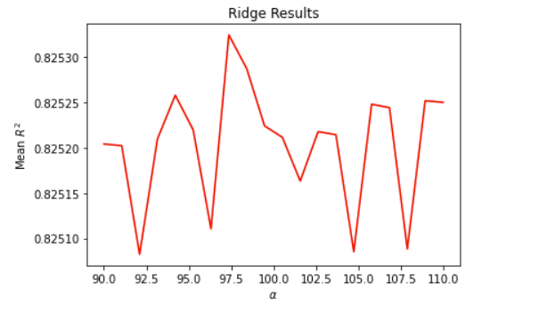
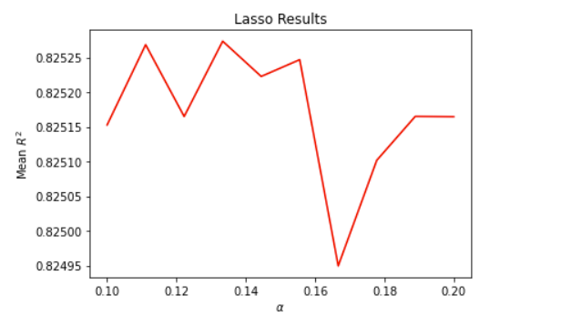

# Project 5 - Part 1

### Question 1: Download the anonymized dataset describing persons.csv from a West African county and import it into your PyCharm project workspace (right click and download from the above link or you can also find the data pinned to the slack channel). First set the variable wealthC as your target. It is not necessary to set a seed.

To do this: 

```
import pandas as pd
url = "https://raw.githubusercontent.com/tyler-frazier/intro_data_science/main/data/persons.csv"
pns = pd.read_csv(url, sep=",")

check_nan = pns['age'].isnull().values.any()
pns.dropna(inplace = True)

#display(pns.dtypes)

pns['age'] = pns['age'].astype(int)
pns['edu'] = pns['edu'].astype(int)

#display(pns.dtypes)

X = pns.drop(["wealthC", "wealthI"], axis = 1)
y = pns.wealthC
```
Drop any null values, then cast any float values to integers.

Set X (feature variables) as every column except for the target variables (`wealthC` and `wealthI`)
Set y (target variable) as `wealthC` as specified 

### Perform a linear regression and compute the R^2. Standardize the features and again compute the R^2. Compare the coefficients from each of the two models and describe how they have changed.

The R^2 value without K-Fold or standardization: 0.736

The R^2 value with standardization and no K-Fold:  0.736

We can use the DoKFold function defined in class to compute the R^2. 

The R^2 value with K-Fold and no standardization (testing score): 0.756

The R^2 value with K-Fold and standardization (testing score): 0.756

Results show that performing a K-Fold validation instead of running the basic regression was more effective. We also see that standardizing the feature variables did not change the R^2 values. 

### Run a ridge regression and report your best results.

The alpha range that I set here for the following results was `np.linspace(70, 80, 20)`

Optimal Alpha value: 73.684

Training Score: 0.736

Testing Score: 0.735

Plot: 

 

## Run a lasso regression and report your best results.

The alpha range that I set here for the following results was `np.linspace(0.001, 0.003, 10)`

Optimal Alpha value: 0.00189

Training score: 0.736

Testing score: 0.735

Plot: 



## Repeat the previous steps using the variable wealthI as your target.

### Ridge Regression:

The alpha range that I set here for the following results was `np.linspace(90,110,20)`

Optimal Alpha value: 97.368

Training score: 0.826

Testing score: 0.825

Plot:



### Lasso Regression:

The alpha range that I set here for the following results was `np.linspace(0.1, 0.2, 10)`

Optimal Alpha value: 0.13333

Training score: 0.826

Testing score: 0.825

Plot:

 

## Which of the models produced the best results in predicting wealth of all persons throughout the smaller West African country being described? Support your results with plots, graphs and descriptions of your code and its implementation. You are welcome to incorporate snippets to illustrate an important step, but please do not paste verbose amounts of code within your project report. Alternatively, you are welcome to provide a link in your references at the end of your (part 1) Project 5 report.

There was little to no difference between the different types of regression models. There was some difference in R^2 with linear regression with and without K-Fold; K-Fold performed slightly better. The biggest difference came in changing the target y variable from `wealthC` to `wealthI`. R^2 values were considerably higher with the `wealthI` as the target. Additionally, standardizing the dataset did not seem to have a meaningful difference, as seen when performing linear regression with/without standardization. 


