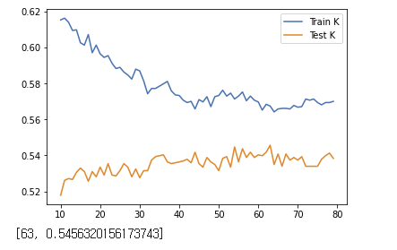

# Project 5 - Part 1

### Question 1: Download the anonymized dataset describing city_persons.csv from a larger city in a West African county and import it into your PyCharm project workspace (right click and download from the above link or you can also find the data pinned to the slack channel). This time we will only use the variable wealthC as your target. It is not necessary to set a seed.

To do this, 

```
url = "https://raw.githubusercontent.com/tyler-frazier/intro_data_science/main/data/city_persons.csv"
pns = pd.read_csv(url, sep = ",")

pns.dropna(inplace=True)

display(pns.dtypes)

pns['age'] = pns['age'].astype(int)
pns['edu'] = pns['edu'].astype(int)

X = pns.drop(["wealthC", "wealthI"], axis=1)
y = pns.wealthC

```

### Question 2: Execute a K-nearest neighbors classification method on the data. What model specification returned the most accurate results? Did adding a distance weight help?

I executed the classification method with the range `np.arrange(10,80)`. 

Max. testing score: 0.546

Alpha value: 63

Plot: 



With the distance added, 

Max. testing score: 0.504

Alpha value: 53

Plot: 


There was not a marked difference between the two models. The first model without the distance weight added actually performed slightly better, but only by a small margin.

### Question 3: Execute a logistic regression method on the data. How did this model fair in terms of accuracy compared to K-nearest neighbors?

Training score: 0.555 

Testing score: 0.539

Again, there was not much of a significant difference between this model and the KNN models. It performed a little better than the KNN with distance by a slight margin, and performec a little worse than the KNN without distance also by a small margin. 

### Question 4: Next execute a random forest model and produce the results. See the number of estimators (trees) to 100, 500, 1000 and 5000 and determine which specification is most likely to return the best model. Also test the minimum number of samples required to split an internal node with a range of values. Also produce results for your four different estimator values by both comparing both standardized and non-standardized (raw) results.

#### Random Forest without standardization :

|   | 100 | 500 | 1000 | 5000 |
|---|-----|-----|------|------|
|Training   |  0.7942708333333334   | 0.7942708333333334    | 0.7942708333333334     | 0.7942708333333334     |
|Testing   |  0.5012201073694486   | 0.5021961932650073    |  0.5070766227428014    | 0.5041483650561249     |

The values for training values were all the same, while the testing scores differed slightly. 1000 trees produced the best testing score, and 100 trees produced the worst.

#### Minimum samples for split: 

|   |  20 |  21 | 22  | 23   |24   | 25  | 26 |  27 | 28  |  29 |
|---|---|---|---|---|---|---|---|---|---|---|
| Training  | 0.6595052083333334  |0.6549479166666666   | 0.6536458333333334  | 0.6471354166666666  | 0.6451822916666666  |  0.6435546875 | 0.6432291666666666  | 0.642578125  | 0.6373697916666666  |0.638671875 |
|  Testing |  0.550024402147389 |0.5475841874084919   |0.5490483162518301   |0.5505124450951684   | 0.5470961444607125  | 0.552464616886286  | 0.5466081015129332  |0.5475841874084919   | 0.5485602733040508  |0.5495363591996095    |
 
While the training score for this model was not as high as the ones from the previous model, the testing scores were higher by a small amount. 

#### Random Forest with standardization:

|   | 100 | 500 | 1000 | 5000 |
|---|-----|-----|------|------|
|Training   |  0.7942708333333334   | 0.7942708333333334    | 0.7942708333333334     | 0.7942708333333334    |
|Testing   |  0.5036603221083455  | 0.5012201073694486   |  0.4987798926305515    | 0.5031722791605662     |

Looking at the training and testing values for the model with standardization, we see that there is not much of a difference from the model with standardization. The training values were all equivalent, just like the model with standardization, and the testing values are just about the same. 

### Question 5: Repeat the previous steps after recoding the wealth classes 2 and 3 into a single outcome. Do any of your models improve? Are you able to explain why your results have changed?

#### KNN 

##### Without distance 

Max. testing score: 0.555

Alpha value: 50

Plot: 


There is a slight increase in the testing value, but not by a significant amount. 

##### With distance 

Max. testing score: 0.505

Alpha value: 79

Plot: 


The testing score increased by a slight amount. This is to be expected, since the merging of the wealth classes would result in less variance due to the decrease in number of groups. Less variance usually results in more accurate classification.  
#### Logistic Regression

Training: 0.554

Testing: 0.531

It performed slightly worse, but not by a large amount. the previous testing value was 0.539.

#### Random Forest without standardization :

|   | 100 | 500 | 1000 | 5000 |
|---|-----|-----|------|------|
|Training   |  0.7913411458333334   | 0.7913411458333334  | 0.7913411458333334   | 0.7913411458333334    |
|Testing   |  0.51634943875061   | 0.5119570522205954   |  0.5148853099072719    | 0.51634943875061    |

The testing values generally increased by 0.01, which is more significant that any other change we have observed. 

#### Minimum samples for split: 

|   |  20 |  21 | 22  | 23   |24   | 25  | 26 |  27 | 28  |  29 |
|---|---|---|---|---|---|---|---|---|---|---|
| Training  | 0.6572265625  |0.6510416666666666 | 0.6552734375 | 0.6516927083333334 | 0.6438802083333334 | 0.6468098958333334| 0.6412760416666666  | 0.6383463541666666  | 0.6402994791666666 |0.63671875 |
|  Testing | 0.5588091752074182  |  0.5534407027818448 |  0.5514885309907271 | 0.5495363591996095  | 0.5563689604685212  |  0.5529526598340654 | 0.5602733040507565  | 0.55734504636408  | 0.5568570034163006  |  0.5592972181551976  |
 
The scores increased overall.

#### Random Forest with standardization :

|   | 100 | 500 | 1000 | 5000 |
|---|-----|-----|------|------|
|Training   |  0.798828125 |0.798828125  | 0.798828125 | 0.798828125  |
|Testing   |  0.48462664714494874   | 0.49097120546608103   |  0.4904831625183016   | 0.4870668618838458    |

This model yielded the most signifcantly worsened testing scores. the general decrease was around 0.02. 

### Question 6: Which of the models produced the best results in predicting wealth of all persons throughout the large West African capital city being described? Support your results with plots, graphs and descriptions of your code and its implementation. You are welcome to incorporate snippets to illustrate an important step, but please do not paste verbose amounts of code within your project report. Avoiding setting a seed essentially guarantees the authenticity of your results. You are welcome to provide a link in your references at the end of your (part 2) Project 5 report.

The model that yielded the best results was the random forest model with 26 sample splits after combining wealth classes 2 and 3. However, there is a slight overfit, with the difference between the train and test scores being 0.081. I did not have a single model that performed significantly better than the others. However, I found that models performed generally better after the wealth classes were merged by a small margin. Besides that, most of the models performed between a range of 0.49 ~ 0.56.  


